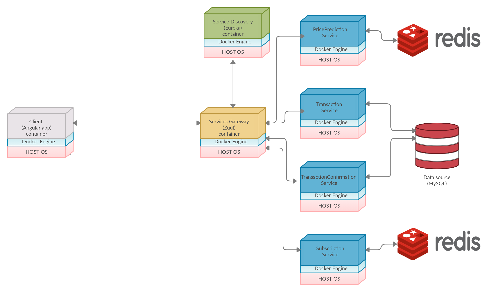

# CarDealer
  

Service that offers support for vehicles transaction (buy, sell) in distributed environment (based on [Otomoto](https://www.otomoto.pl/)).

### Prerequisites

- Java 11
- Redis
- MySQL
- Amazon S3 bucket

### Architecture

#####  App architecture consists of two main parts:

##### 1. Frontend
Frontend consists of angular app for end client user

##### 2. Backend
Backend consists of eveything else, contains about 8 dockerized microservices. For dynamically routing and authentication by JWT i've used Zuul as reverse proxy with Eureka for service discovery. Behind proxy there are 4 types of services:
- Price prediction service
- Transaction service
- Transaction confirmation service
- Subscription service

Name of each service corresponds to its job. Price prediction service uses machine learning based algorithms for price prediction of cars in future years based on automotive datasets. Transaction service is the core of whole backend. It's respond for all operation types connected with offers like creating it, removing, getting search filters, retrieving user's offers, uploading images to AWS bucket. Transaction confirmation service was designed for admin-type users of app. Service allows to confirm if offers created by end-users are legit. Subscription service mainly deals with user subscriptions, and visits counter for each offer,it's connected to Redis database as it's in-cache-speed is required for proper work of service. Requests to transaction service are distributed by load balancer based on BestAvailableRule class (A rule that skips servers with "tripped" circuit breaker and picks the server with lowest concurrent requests).

 

