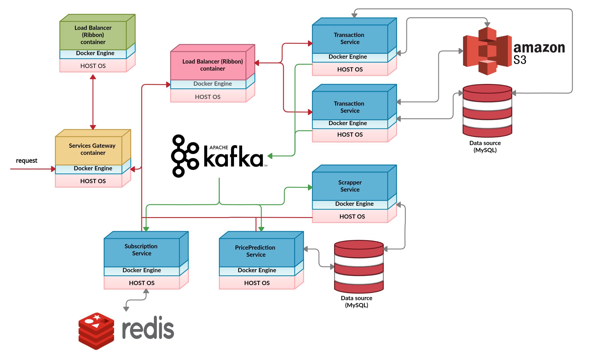

# CarDealer

Service that offers support for vehicles transaction (buy, sell) in distributed environment (based on [Otomoto](https://www.otomoto.pl/)).

### Prerequisites

- Java 11
- Redis
- MySQL
- Amazon S3 bucket

### Architecture

#####  App architecture consists of two main parts:
- ###### frontend
- ###### backend

